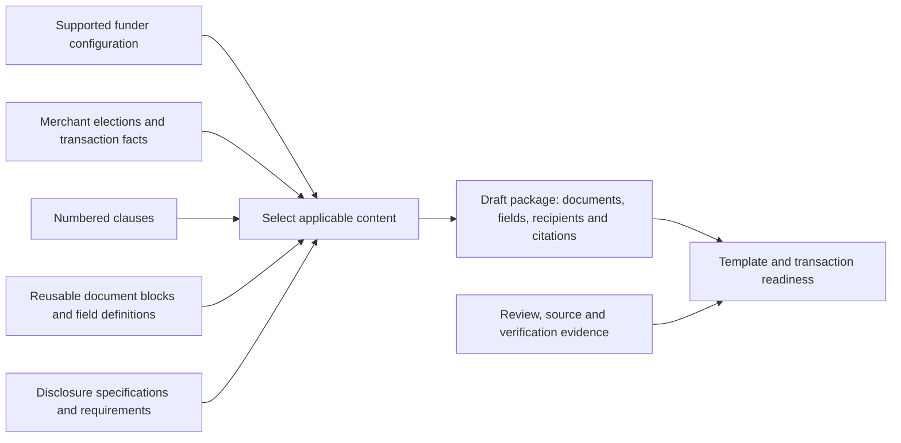

# MCA workspace: classification and migration plan

The accepted product and catalogue boundaries are in
[ADR 0015](../adr/0015-one-mca-workspace-with-separate-content-catalogues.md).
This is the implementation planning companion, not an implemented migration or
approval of the existing legal wording.

## Evidence and present behavior

Inspected **2026-09-13**, main
`1813b1d72fb231593ddcb2cb0b2a55054ac7f040`:

- [`McaClause`](../../packages/bizrethink/mca/clauses/types.ts) permits clause,
  field-group and explainer kinds, with an optional `unnumberedReason`.
- [`ALL_MCA_CLAUSES` and `libraryFor`](../../packages/bizrethink/mca/clauses/library.ts)
  register all three kinds. The
  [surface model](../../packages/bizrethink/mca/clauses/surface/view.ts) counts them
  together. The [admin page](../../apps/remix/app/routes/_authenticated+/admin+/mca-library.tsx)
  prints a dash for an empty number.
- [Selection](../../packages/bizrethink/mca/engine/select-clauses.ts),
  [numbering](../../packages/bizrethink/mca/engine/number-clauses.ts) and
  [review examples](../../packages/bizrethink/mca/review/numbered-library.ts)
  already derive citations after selection and resolve stable references.
- The [disclosure registry](../../packages/bizrethink/mca/registry.ts) distinguishes
  prescribed forms, itemizations and content statutes. The
  [conformity view](../../packages/bizrethink/mca/surface/view.ts) and
  [instance checks](../../packages/bizrethink/mca/instance/check.ts) report
  different evidence; neither is a general approval of the package.

A read-only inventory of the six instrument directories finds **211 records**:
203 typed clauses, four field groups and four explainers. **15 are unnumbered**:
10 typed clauses, one field group and four explainers. Another **three numbered
field groups** make the initial classification set below **18 records**. These
counts describe the current registry, not the final clause catalogue size.

The remaining 193 entries are numbered and typed as clauses. That is a starting
inventory classification, not proof that each contains only clause material.
Implementation must check the full corpus for mixed content and references,
while concentrating the extraction review on the 18 known cases.

## Initial destination map

**Clause** retains operative language as a numbered provision. **Reusable**
preserves a required document/field block outside the clause catalogue.
**Split** needs an explicit old-to-new mapping before migration. These are
planning dispositions based on the current bodies; exact extraction boundaries
remain for implementation review. Nothing in this table authorizes deletion,
new contractual wording or transfer of an approval to a new record.

| Current stable identity | Current shape | Planned destination and content to preserve |
|---|---|---|
| `frpa.merchant-and-funding-information` | Unnumbered field group | Reusable funding/party grid; preserve all 30 widgets, requiredness and document placement. |
| `frpa.holdback-explainer` | Unnumbered explainer | Split teaching prompt from the numbered estimate/collection limits and reconciliation references. |
| `frpa.equipment-cost-explainer` | Unnumbered explainer | Split any interview explanation from numbered purchase/lease allocation, deduction and no-double-charge terms. |
| `frpa.equipment-cost-exclusivity` | Unnumbered explainer | Clause: preserve the deduction, calculation-responsibility and cost restrictions. Its current label does not make it guidance. |
| `frpa.rollover-method-election` | Unnumbered explainer | Split election/data capture from numbered election, completion and settlement requirements; preserve widget `«25»`. |
| `frpa.parties` | Unnumbered clause | Split the identification preamble from numbered funding-trigger, incorporation and third-party-capacity terms. |
| `frpa.representations-lead-in` | Unnumbered clause | Clause: preserve the dates, scope and limits governing every representation. |
| `frpa.execution` | Unnumbered clause | Split execution structure from numbered capacity, factual-statement, liability and document-delivery provisions. |
| `frpa.guarantor-information-9-1` | Numbered field group with prose | Split identification fields from numbered guarantor-capacity, notice and identification-handling protections; preserve the no-guaranty gate. |
| `equipment-lease.parties` | Unnumbered clause | Reusable identification/effective-date preamble, retaining defined parties and its link to the equipment grid. |
| `equipment-lease.guarantor-information` | Numbered field group | Reusable equipment-guarantor identification fields, preserving instrument-specific widgets and requiredness. |
| `subscription.parties` | Unnumbered clause | Reusable identification/effective-date preamble, retaining defined parties and its link to the subscription grid. |
| `subscription.guarantor-information` | Numbered field group | Reusable subscription-guarantor fields; retain their own instrument identity even where labels match the lease. |
| `permission-to-release.preamble` | Unnumbered clause | Split identifying fields/lead-in from any operative grant or signer-capacity scope, using the reviewed ancillary correction when available. |
| `iso-pra.parties` | Unnumbered clause | Reusable party/effective-date preamble; preserve definitions and placeholders. |
| `iso-pra.recital-company-business` | Unnumbered clause | Reusable background recital, retaining its wording and review evidence. |
| `iso-pra.recital-partner-purpose` | Unnumbered clause | Reusable referral-purpose recital, retaining the relationship described and review evidence. |
| `iso-pra.consideration` | Unnumbered clause | Reusable consideration lead-in; preserve it in the agreement and its review context. |

Source locations: FRPA
[funding/preamble](../../packages/bizrethink/mca/clauses/frpa/preamble.ts),
[representations](../../packages/bizrethink/mca/clauses/frpa/representations.ts),
[execution](../../packages/bizrethink/mca/clauses/frpa/appendix.ts) and
[guaranty](../../packages/bizrethink/mca/clauses/frpa/guaranty.ts);
[equipment preamble](../../packages/bizrethink/mca/clauses/equipment-lease/agreement.ts)
and [guarantor fields](../../packages/bizrethink/mca/clauses/equipment-lease/guaranty.ts);
[subscription preamble](../../packages/bizrethink/mca/clauses/subscription/agreement.ts)
and [guarantor fields](../../packages/bizrethink/mca/clauses/subscription/guaranty.ts);
[release](../../packages/bizrethink/mca/clauses/permission-to-release/sections.ts);
[ISO preamble/recitals](../../packages/bizrethink/mca/clauses/iso-pra/commission.ts).

A block's destination does not decide whether it is optional or legally
consequential. Reusable document wording remains reviewable. Extract interview
guidance only where useful; do not create a second paraphrased agreement merely
to populate a helper catalogue. Keep reusable field definitions separate from
filled merchant/guarantor data and preserve existing access boundaries.

## Dependency map for the future builder

This is the target relationship, not a diagram of an implemented renderer.
Interview guidance explains supported choices and captures facts; it is not
inserted into the package unless separately classified for document use.

| Trigger or input | Relationships the design must expose |
|---|---|
| Funder offers equipment; merchant elects purchase/lease/subscription | FRPA cost clauses and funding fields, applicable equipment document and its own guaranty, and relevant disclosure calculations. Offering equipment and selecting the merchant's transaction are separate facts. |
| Renewal/settlement choice | Prior-transaction fields, selected settlement clause, net-funding itemization and matching disclosure figures. |
| Guaranty configuration and identified signers | Selected guaranty clauses, identification/execution blocks and recipient capacities. The FRPA answer does not govern an equipment provider's separate guaranty. |
| Recipient state and transaction characteristics | Applicable agreement requirements, disclosure type, source/verification evidence and unresolved applicability questions. A jurisdiction lookup alone is not a complete applicability determination. |
| Processor selection and acceptance | Collection provisions, approved-processor fields and the specific processor letter. Acceptance is a transaction prerequisite to assess; moving `processorSplitAccepted` remains a separate implementation task. |
| Consumer-report authorization | Permission to Release, individual/merchant identity, signer capacity and applicable FRPA consent provisions. |

Pacta owns the assembly. The upstream business application supplies deal facts
and calculations under ADR 0010; no duplicate disclosure calculator is proposed.
Readiness must show missing or inconsistent supplied figures and any checks that
cannot run, rather than treating an empty findings list as complete validation.

Split Funding Letters are processor-specific and usually offer limited or no
ability for Pacta to change their terms. Preserve that external-document
constraint and surface relevant contradictions in package review. Do not
silently rewrite a processor form or call those contradictions resolved.

## Migration boundaries and acceptance criteria

1. Re-inventory the latest merged corpus. Incorporate reviewed corrections from
   [#187](https://github.com/BizRethinkAI/internal-bizrethink-pacta-platform/pull/187),
   [#190](https://github.com/BizRethinkAI/internal-bizrethink-pacta-platform/pull/190)
   and [#194](https://github.com/BizRethinkAI/internal-bizrethink-pacta-platform/pull/194)
   when available; all were open at this inspection. Record exact extraction
   boundaries and old-to-new IDs for mixed records, with every body span and field
   accounted for. Do not preassign a final clause count.
2. Introduce separate catalogue contracts and entry points in the existing MCA
   package. Clauses and their counts cannot contain helpers; all displayed
   clauses are numbered for a valid selection context. Required reusable blocks
   remain available for review and assembly. Preserve supported choices and
   exclusion explanations; do not broaden commercial gates as part of extraction.
3. Preserve stable identities where their meaning survives. Give split content
   explicit new identities and traceable relationships; keep historical findings
   against their original evidence. Inspect
   [approval storage](../../packages/bizrethink/mca/server-only/clause-approvals.ts),
   [fingerprints](../../packages/bizrethink/mca/clauses/approval.ts), review-link
   scope, reference targets and field/recipient consumers before selecting any
   storage migration. Do not infer that production approval rows are absent.
4. Make the smallest common MCA navigation change that exposes the catalogues
   already delivered. Preserve admin authorization and token-scoped counsel
   access, read-only conformity, existing URLs via compatibility routing, and
   separate review/verification evidence. A shared layout must not broaden access.
5. Use focused failing tests for the changed contracts: no helper in clause APIs
   or counts; valid numbers and references across supported selections; retained
   blocks/fields/conditions; appropriate invalidation without inherited approvals;
   staff/counsel access and review coverage across both content catalogues. Use
   existing CI and Playwright gates for the actual user-flow change, per the
   engineering standard. No duplicate broad local run is implied.

The first implementation is catalogue separation plus common navigation and
their affected consumers. Full interview, PDF/package assembly, template and
transaction readiness enforcement, separate guaranty placement/numbering, and
stored-template rebuilds remain separately scoped work. Preserve existing signed
documents. Any live data operation or substantive legal rewrite needs its own
explicit scope and the repository's applicable independent review.

## Design validation

This document records repository behavior and the owner's product decision. It
adds no statutory conclusion and does not repeat the eleven-state research.
That evidence remains in the
[requirements report](../research/mca-agreement-requirements-2026-09-12/README.md)
and [clause metadata record](../research/mca-clause-metadata-2026-09-12/README.md).
Documentation validation checks the inventory/IDs, linked files, ADR precedence
and change scope. Runtime acceptance criteria above remain unimplemented.
