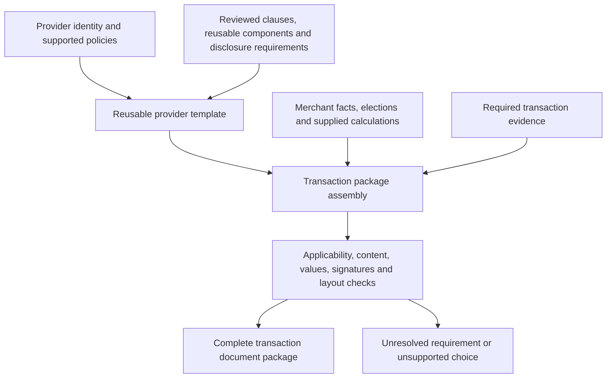

# How this review serves the provider interview

The product outcome is a provider interview that creates a reusable MCA
document-package template. A merchant transaction later supplies its own facts,
elections, calculations, approvals and signatures. The provider should not have
to repeat the interview for each funding, and the template must not pretend to
know future transaction facts.

## Four inputs with different authority

| Input | Examples | What it can establish |
|---|---|---|
| Provider identity and policy | Legal entities, organization type/state, funder/equipment/processor roles, real servicing contacts, supported collection base/method, guaranty/channel/renewal options | The supported template choices and named counterparties, subject to reviewed content being available |
| Merchant and transaction facts | Legal merchant and business nexus, purchase figures, real fees, prior payoff and unpaid charges, equipment buy/lease/subscription election, guarantor identities | Actual applicability and completed financial/document values; not a new blanket provider policy |
| Required evidence | Current registration where needed, processor-required form/version and transaction acceptance, individual report instructions, actual disclosure delivery and signatures | Whether the transaction prerequisites have been met; a provider checkbox is not the evidence |
| Reviewed law and authored content | Current source/version, prescribed form, content-only disclosure rule, clause, reusable data/presentation component, approved alternate wording | What the package must say, contain or do for the established facts; source silence does not prove a rule is optional |

The current `McaFacts` model mixes some of these ideas. In particular,
`processorSplitAccepted` cannot be a permanent fact proving future processor
acceptance, and `recipientStates` cannot determine every transaction's nexus or
exemption. This review records that design dependency without changing the type.

## One coherent package

This diagram is a review dependency model. It does not prescribe a new
calculation engine, replace ADR 0010's integration boundary, or authorize a
merchant-facing interview. Provider policy selects supported wording;
transaction facts and merchant elections fill or instantiate the allowed
package paths. Where a transaction needs an unsupported path, the system must
surface that dependency instead of quietly substituting the baseline.

The catalogue boundaries should preserve different controls: numbered operative
clauses; reusable fields, explanations and presentation components; and
disclosures/requirements with the appropriate source and conformity checks.
Shared search, provenance and review infrastructure can serve all three. A
legally prescribed separate disclosure stays a separate document in the
executed package even when all content is managed in one MCA workspace.

An explanation required inside a disclosure is not freely replaceable merely
because the regulator left its wording to the provider. Conversely, a form-grid
record containing substantive promises does not become legally insignificant
when its data fields move to a reusable catalogue. Final boundaries must follow
the body-level review and preserve the complete bargain.

## Decisions and dependencies before implementation

| Area | Ready input | Still needed |
|---|---|---|
| Core MCA bargain | Net card-receipt, processor-split language; reconciliation, cap and narrow default protections read together | Verified provider pricing base and servicing capability; complete reviewed alternatives before offering different options |
| Data and identity | Existing fields and references inventoried in coverage/findings | Correct funding/itemization meanings, missing bindings, safe identifiers and repeated signature capacities |
| Equipment | Both complete agreements and their relationship with the FRPA reviewed | Product classification, consistent payment/title/default/guaranty terms and the corresponding disclosure choice |
| Processor documents | Known conflict and owner-defined external control recorded | Actual required form/version, compatible instructions and accepted transaction procedure, through its separate review |
| Reports and contact | Pending #194 scope and current FCRA/FCC source qualifications recorded | Independent review plus actual forms, purpose certification, optional consent, expiry/revocation and notice workflows |
| ISO channel | Existing referral-only and commission policy understood | Provider choice, current broker applicability/registration facts, coherent transmission/clawback controls |
| State conformity | Eleven dedicated schemes and existing prescribed/content-only distinction | Named source gaps, actual applicability, conditional rows, values, required explanations, sequence/signatures and rendered formatting |
| Final mapping | Stable IDs and the provisional 18-case design | Sentence/field/subclause disposition, embedded numbering/reference audit and preservation of history/approvals |

For efficiency, use these dependencies to scope the next changes. Do not add a
second broad legal rewrite while pending corrections await review. Do not run
application browser tests for this research-only PR. When actual fields,
selection, signing, money or template flows change, apply the repository's TDD,
focused local checks, separate type checking, relevant browser checks and CI
requirements. Source refresh, legal review, functional validation and merge
approval are distinct pieces of evidence.
